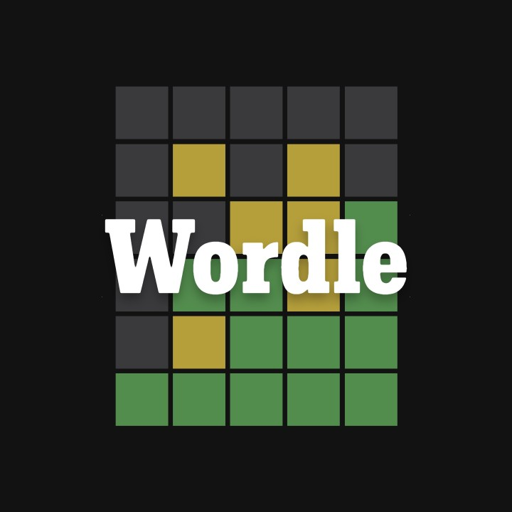

# Wordle




## <a href="https://www.youtube.com/watch?v=UNz9k9E9IWM"> Demo Video on YouTube </a>

## Setup

If you want to play around with Bitwise Puzzle, feel free to clone my repo. To start, please enter the following commands on your terminal:

```
git clone https://github.com/CamNagle24/Bitwise-Puzzle
make
```

At this point, you are free to type in whatever sequence of commands you like.

```
./btest
```

./btest will give you all the tests that the code tests and passes.
