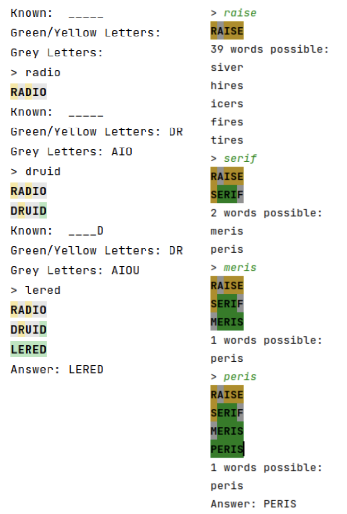

## This is the game Wordle you can play in your terminal!

### What I Learned

- User interface design: Created a simple text-based interface that provides visual feedback to users with colors.
- Algorithm design: Designed algorithms to determine valid guesses, match guesses with feedback, and filter possible words.
- Working with strings and tuples: Gained experience manipulating strings and tuples, especially in parsing guesses and clues.
- Dealing with repeated letters: Managed complex scenarios such as handling words with repeated letters and ensuring accurate clues.
- Word filtering logic: Developed filtering functions to narrow down possible words based on clues, as seen in easy Wordle mode.

``` You can play Hard Mode                        Or Easy Mode ```



## <a href="https://youtu.be/M_KFGMcOTA4"> Demo Video on YouTube </a>

## Setup

If you want to play around with Bitwise Puzzle, feel free to clone my repo. To start, please enter the following commands on your terminal:

```
git clone https://github.com/CamNagle24/Wordle
python3 ./wordle.py
#OR
python3 ./easy_wordle.py
```

You can edit the word "WORDY" with whatever you want your secret word to be at the bottom of each file.

Then the game will start as such below

```
> GUESS
```
And you can play the game as normal from there! (Only 5 letter words)
